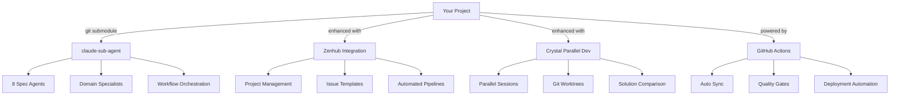

# 🚀 Agentic Dev Starter

**Transform your development workflow with AI-powered agents in under 5 minutes**

[](https://github.com/Jimmycarroll2021/agentic-dev-starter)
[](https://nodejs.org/)
[](LICENSE)
[](https://github.com/Jimmycarroll2021/agentic-dev-starter/generate)

> **✨ The fastest way to set up an AI-driven development workflow**  
> From project idea to production-ready code with specialized AI agents

---

## 🎯 Quick Start

### Option 1: One-Click Setup (Recommended)
```bash
npx agentic-dev-starter
```

### Option 2: Template Repository
[**Use This Template →**](https://github.com/Jimmycarroll2021/agentic-dev-starter/generate)

### Option 3: Clone & Setup
```bash
git clone https://github.com/Jimmycarroll2021/agentic-dev-starter.git
cd agentic-dev-starter
npm run setup
```

---

## ⚡ What You Get

### 🤖 **8 Specialized AI Agents**
- **spec-orchestrator** - Coordinates your entire workflow
- **spec-analyst** - Analyzes requirements with precision  
- **spec-architect** - Designs scalable system architecture
- **spec-planner** - Creates detailed implementation roadmaps
- **spec-developer** - Writes production-quality code
- **spec-tester** - Generates comprehensive test suites
- **spec-reviewer** - Performs thorough code reviews
- **spec-validator** - Ensures everything meets standards

### 📋 **Project Management Integration**
- **Zenhub** boards, labels, and epic templates
- **GitHub Actions** for automated workflows  
- **Issue templates** for structured requirements
- **Automated synchronization** between tools

### ⚡ **Parallel Development**
- **Crystal** integration for concurrent Claude Code sessions
- **Git worktrees** for exploring multiple approaches
- **Diff comparison** between parallel solutions
- **Automated merge strategies**

---

## 🏗️ Architecture



---

## 🔧 Features

### ✅ **Instant Setup**
- Zero-configuration start
- Automated dependency detection  
- Interactive setup wizard
- Cross-platform support (Windows, macOS, Linux)

### 🎛️ **Smart Defaults**
- Pre-configured agent workflows
- Sensible project structure
- Best-practice templates
- Production-ready configurations  

### 🔄 **Automated Workflows**
- Nightly agent synchronization
- Automated issue triaging
- Quality gate enforcement
- Deployment pipelines

### 🛠️ **Developer Experience**
- Visual progress indicators
- Real-time feedback
- Error recovery
- Comprehensive logging

---

## 📖 Usage Examples

### Basic Workflow
```bash
# 1. Setup your environment
npm run setup

# 2. Sync your AI agents  
npm run agents:sync

# 3. Start developing with Claude Code
# Your agents are now available as sub-agents!
```

### Advanced Usage
```bash
# Apply Zenhub project management templates
npm run zenhub:apply

# Run parallel development sessions
crystal start --parallel-sessions=3

# Generate comprehensive project reports
npm run report:generate
```

### Integration with Claude Code
```yaml
# .claude/config.yml
agents:
  - name: spec-orchestrator
    type: workflow-coordinator
    auto_sync: true
    
  - name: spec-developer
    type: code-generator
    languages: [typescript, python, rust]
    
project:
  type: full-stack
  framework: auto-detect
  testing: comprehensive
```

---

## 📚 Documentation

| Topic | Description | Link |
|-------|-------------|------|
| **Quick Start** | Get up and running in 5 minutes | [Guide](docs/quickstart.md) |
| **Agent Reference** | Complete guide to all 8+ agents | [Docs](docs/agents/) |
| **Workflow Examples** | Real-world development scenarios | [Examples](examples/) |
| **Integration Guide** | Zenhub, GitHub, Crystal setup | [Guide](docs/integrations.md) |
| **Best Practices** | Tips for maximum productivity | [Guide](docs/best-practices.md) |
| **Troubleshooting** | Common issues and solutions | [FAQ](docs/troubleshooting.md) |

---

## 🎯 Use Cases

### 🚀 **Startups & Solo Developers**
- Rapid prototyping with AI assistance
- Professional project structure from day one
- Automated testing and deployment
- Cost-effective development acceleration

### 🏢 **Development Teams**  
- Standardized workflows across projects
- Collaborative AI-assisted development
- Quality gates and peer review automation
- Knowledge sharing and documentation

### 📚 **Learning & Education**
- Best-practice project templates
- Step-by-step development guidance  
- Real-world workflow experience
- AI pair programming tutorials

---

## 🌟 What Makes This Special

### 🔥 **Instant Gratification**
- Working example in < 5 minutes
- No complex configuration required
- Immediate value from first use

### 📈 **Progressive Enhancement**  
- Start simple, add complexity as needed
- Optional integrations you can enable later
- Scales from prototype to production

### 🤝 **Community Driven**
- Open source and extensible
- Active community support
- Regular updates and improvements  

### 💡 **Production Ready**
- Battle-tested workflows
- Enterprise-grade reliability  
- Comprehensive error handling

---

## 🛣️ Roadmap

### ✅ **Version 1.0** (Current)
- ✅ 8 Core AI agents
- ✅ One-click setup  
- ✅ GitHub template support
- ✅ Basic Zenhub integration

### 🚧 **Version 1.1** (Next)
- 🔄 Advanced error recovery
- 🔄 Plugin marketplace
- 🔄 Custom agent builder
- 🔄 Performance analytics

### 🎯 **Version 2.0** (Future)
- 📋 Multi-language support  
- 📋 Cloud deployment tools
- 📋 Advanced parallel processing
- 📋 Enterprise features

---

## 🤝 Contributing

We welcome contributions! Here's how to get started:

1. **Fork the repository**
2. **Create a feature branch**: `git checkout -b feature/amazing-feature`
3. **Make your changes and test thoroughly**
4. **Submit a pull request with clear description**

### Development Setup
```bash
git clone https://github.com/Jimmycarroll2021/agentic-dev-starter.git
cd agentic-dev-starter
npm install
npm run dev
```

---

## 💬 Community & Support

- 💬 **Discussions**: [GitHub Discussions](https://github.com/Jimmycarroll2021/agentic-dev-starter/discussions)
- 🐛 **Issues**: [GitHub Issues](https://github.com/Jimmycarroll2021/agentic-dev-starter/issues)
- 📧 **Email**: support@agentic-dev-starter.com
- 🐦 **Twitter**: [@AgenticDev](https://twitter.com/AgenticDev)

---

## 📄 License

MIT License - see [LICENSE](LICENSE) file for details.

---

## 🙏 Acknowledgments

- **[zhsama/claude-sub-agent](https://github.com/zhsama/claude-sub-agent)** - Core agent system
- **[Anthropic](https://anthropic.com)** - Claude AI platform  
- **[GitHub](https://github.com)** - Development platform and actions
- **[Zenhub](https://zenhub.com)** - Project management integration

---

<div align="center">

**⭐ If this project helped you, please consider giving it a star! ⭐**

[](https://star-history.com/#Jimmycarroll2021/agentic-dev-starter&Date)

</div>