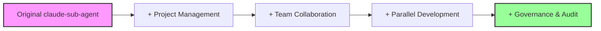
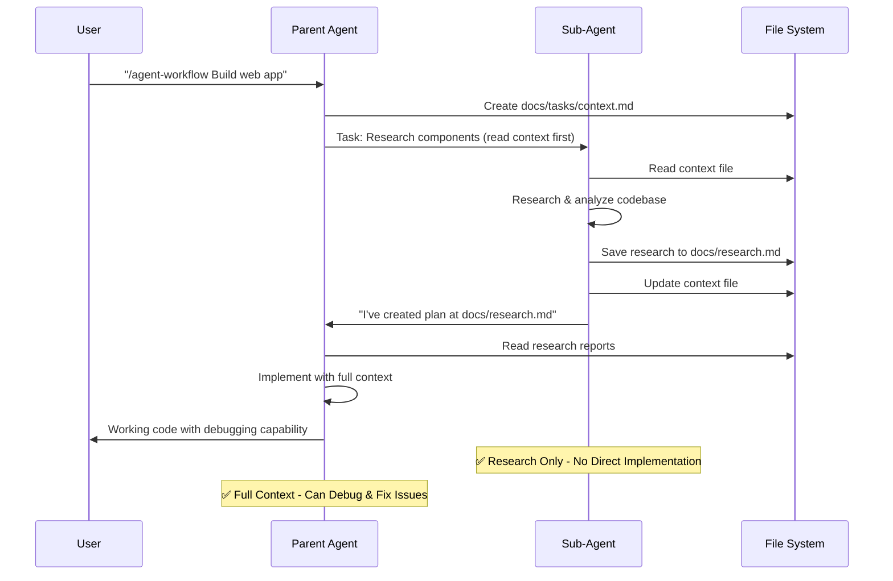
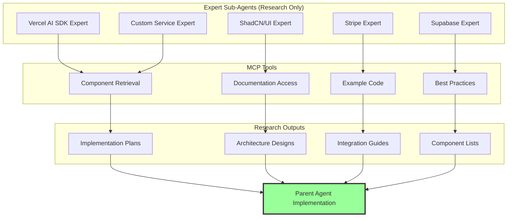
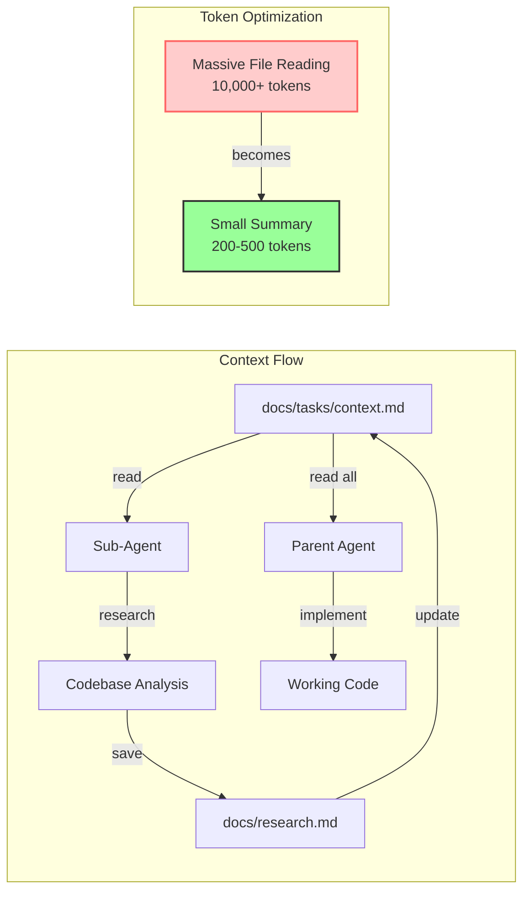
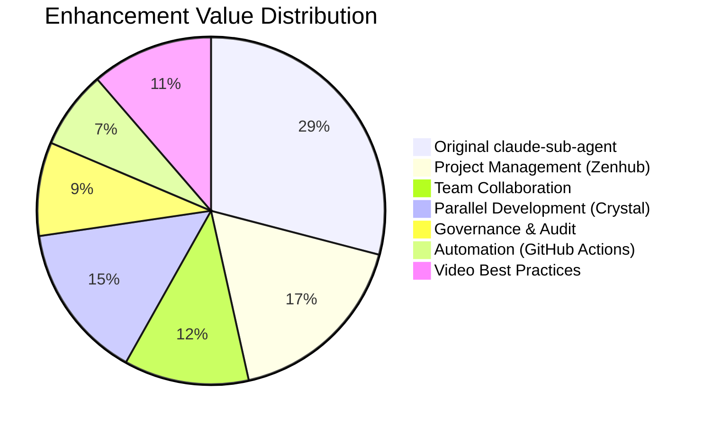

# Agentic Dev Starter

A ready-to-fork repository that combines:

- **Claude Sub-Agent** (as a git submodule) for a structured planning → build → validate workflow.
- A clean set of **Zenhub** boards, labels and starter epics, wired through GitHub Actions.
- An optional **Crystal** preset to run multiple Claude Code sessions in parallel (via git worktrees).

> **Note on licensing**: We reference `zhsama/claude-sub-agent` as a **git submodule** and do **not** re-distribute its files here. You will clone and sync it locally. This avoids licensing issues if the upstream does not provide a permissive license.

---

## 🏗️ Architecture Overview

### **System Architecture**
```mermaid
graph TD
    A[Your Project] -->|git submodule| B[claude-sub-agent]
    A -->|enhanced with| C[Zenhub Integration]
    A -->|enhanced with| D[Crystal Parallel Dev]
    A -->|enhanced with| E[GitHub Actions]
    
    B --> F[8 Spec Agents]
    B --> G[Domain Specialists]
    B --> H[/agent-workflow Command]
    
    C --> I[Project Management]
    C --> J[Issue Templates]
    C --> K[Epics & Pipelines]
    
    D --> L[Parallel Sessions]
    D --> M[Git Worktrees]
    D --> N[Diff Comparison]
    
    E --> O[Auto Sync]
    E --> P[Blueprint Apply]
    
    F --> F1[spec-orchestrator]
    F --> F2[spec-analyst]
    F --> F3[spec-architect]
    F --> F4[spec-planner]
    F --> F5[spec-developer]
    F --> F6[spec-tester]
    F --> F7[spec-reviewer]
    F --> F8[spec-validator]
    
    G --> G1[senior-backend-architect]
    G --> G2[senior-frontend-architect]
    G --> G3[ui-ux-master]
    G --> G4[refactor-agent]
```

### **Enhancement Layers**


---

## Quick start

**Prerequisites**

- Node.js 18+ (for the helper script)
- GitHub account and repository
- (Optional) [GitHub CLI](https://cli.github.com) for convenience (`gh`)
- Zenhub account and the GitHub browser extension *or* Zenhub web app
- Claude Code (or similar) locally
- (Optional) Crystal app for parallel sessions

**1) Create a new GitHub repo and push this scaffold**

```bash
# If using git directly:
git init
git add .
git commit -m "chore: bootstrap agentic dev starter"
git remote add origin https://github.com/<your-org>/<your-repo>.git
git push -u origin main

# Or using GitHub CLI:
gh repo create <your-org>/<your-repo> --source=. --public --push
```

**2) Add the Claude Sub-Agent upstream and sync to .claude/**

```bash
# Adds upstream as a submodule (tracked reference, not copied files)
bash scripts/setup.sh

# This populates .claude/agents and .claude/commands locally (not committed)
bash scripts/agents/sync.sh
```

**3) Set up Zenhub**

1. Install the [Zenhub extension](https://www.zenhub.com/extension) or open the [Zenhub web app](https://app.zenhub.com).

2. Create a Workspace and add your GitHub repo.

3. In GitHub, add a repo secret named `ZENHUB_API_TOKEN` (optional, used for future API work).

4. Trigger the **Apply Zenhub Blueprint** workflow in Actions (manual run).
   - This will create labels and seed epic/issues on the GitHub side. 
   - You can then convert the created Epic issue(s) into Zenhub Epics in the UI.

5. Pipelines are defined in `zenhub/blueprint.yml`. You can mirror them in Zenhub's UI in seconds. Programmatic pipeline creation differs between accounts; the script focuses on GitHub resources (labels/issues) which are stable and reliable.

**4) Start building with the sub-agents**

In Claude Code, run the `/agent-workflow` command from `.claude/commands/` against `examples/webapp` (or your own project).

Commit agent artefacts to `docs/` for traceability before moving Zenhub pipeline state.

**5) (Optional) Use Crystal to explore alternatives in parallel**

Open the repo in Crystal and use the preset in `crystal/project.settings.json`.

Spin up 2–3 sessions, compare diffs/tests, then squash & rebase the winning path to main.

---

## Repository layout

```
.
├─ .github/
│  ├─ ISSUE_TEMPLATE/               # Zenhub-aligned issue forms
│  └─ workflows/
│     ├─ zenhub-apply.yml           # Applies blueprint labels & seed issues
│     └─ agents-sync.yml            # Nightly sync of upstream sub-agents into .claude/, opens PR
├─ .claude/                         # Local-only agent files (synced from submodule)
│  └─ .gitkeep
├─ crystal/
│  ├─ project.settings.json
│  └─ README.md
├─ docs/
│  ├─ playbooks/agentic-dev.md
│  ├─ practices/sub-agents.md
│  └─ governance/
│     ├─ ai-usage.md
│     └─ dpia-template.md
├─ examples/
│  └─ webapp/
│     ├─ package.json
│     ├─ tests/smoke.mjs
│     └─ README.md
├─ scripts/
│  ├─ setup.sh
│  ├─ agents/sync.sh
│  └─ zenhub/
│     ├─ apply-blueprint.mjs
│     └─ README.md
├─ zenhub/
│  └─ blueprint.yml
├─ .gitignore
├─ LICENSE
└─ package.json
```

## 🔄 Sub-Agent Workflow (Video-Proven Best Practices)

### **Research-Only Pattern (Avoids The Big Mistake)**


### **Original vs Enhanced Workflow**

```mermaid
graph TB
    subgraph "❌ Original claude-sub-agent Only"
        A1[User Request] --> B1[Agent Workflow]
        B1 --> C1[Planning Phase]
        C1 --> D1[Development Phase]
        D1 --> E1[Validation Phase]
        E1 --> F1[Code Output]
    end
    
    subgraph "✅ Enhanced Agentic-Dev-Starter"
        A2[User Request] --> B2[Zenhub Epic Creation]
        B2 --> C2[Context File Creation]
        C2 --> D2[Research-Only Sub-Agents]
        D2 --> E2[File System Reports]
        E2 --> F2[Parent Implementation]
        F2 --> G2[Crystal Parallel Testing]
        G2 --> H2[GitHub Actions CI]
        H2 --> I2[Production Ready]
        
        J2[Issue Templates] --> B2
        K2[Governance Checks] --> F2
        L2[Team Collaboration] --> G2
    end
    
    style A1 fill:#fcc,stroke:#f66,stroke-width:2px
    style I2 fill:#cfc,stroke:#6f6,stroke-width:2px
```


## Key workflows

### Issue Templates

- **Story** - User stories with acceptance criteria and story points
- **Bug** - Bug reports with reproduction steps
- **Tech Debt** - Technical improvements
- **Documentation** - Documentation tasks
- **Agent Session** - Capture agent runs and their artefacts

### GitHub Actions

- **zenhub-apply.yml** - Applies labels and creates seed issues from `zenhub/blueprint.yml`
- **agents-sync.yml** - Nightly sync of upstream claude-sub-agent, opens PR with changes

### Scripts

- **scripts/setup.sh** - Adds the claude-sub-agent submodule
- **scripts/agents/sync.sh** - Syncs upstream content into `.claude/`
- **scripts/zenhub/apply-blueprint.mjs** - Applies Zenhub blueprint via GitHub API

## Documentation

- **docs/playbooks/** - Step-by-step workflow guides
- **docs/practices/** - Field-tested sub-agent practices
- **docs/governance/** - AI usage policies and DPIA templates

## 🎯 Expert Sub-Agent Network

### **Service-Specific Research Agents**


### **File System Context Management**


## Example usage

1. **Create an Epic** in Zenhub from the seeded issues
2. **Run the agent workflow**:
   ```bash
   # In Claude Code
   /agent-workflow "Build a task management web app with user authentication"
   ```
3. **Review artefacts** (requirements.md, architecture.md, tasks.md, test-plan.md)
4. **Move through phases**: Planning → Development → Validation
5. **Commit artefacts** to `docs/YYYY-MM-DD/<issue-number>/` for audit trail

## 📈 Enhancement Value Proposition

### **What We Added Beyond Original**


### **Integration Ecosystem**
```mermaid
graph TB
    subgraph "🔄 Core Workflow Engine"
        A[claude-sub-agent<br/>Upstream Submodule]
        A1[8 Spec Agents]
        A2[Domain Specialists]
        A3[/agent-workflow Command]
    end
    
    subgraph "📋 Project Management Layer"
        B[Zenhub Integration]
        B1[Epics & Pipelines]
        B2[Issue Templates]
        B3[Roadmap Visualization]
    end
    
    subgraph "🤝 Team Collaboration Layer"
        C[GitHub Actions]
        C1[Auto Sync Agents]
        C2[Blueprint Application]
        C3[PR Integration]
    end
    
    subgraph "🔬 Development Layer"
        D[Crystal Parallel Sessions]
        D1[Git Worktrees]
        D2[Diff Comparison]
        D3[Test Execution]
    end
    
    subgraph "🛡️ Governance Layer"
        E[Documentation Framework]
        E1[AI Usage Policies]
        E2[DPIA Templates]
        E3[Audit Trails]
    end
    
    A --> B
    B --> C
    C --> D
    D --> E
    
    style A fill:#f9f,stroke:#333,stroke-width:3px
    style E fill:#9f9,stroke:#333,stroke-width:3px
```

## Crystal integration (optional)

Crystal enables parallel development with isolated git worktrees:

1. Install Crystal: `brew install --cask stravu-crystal`
2. Open this repo in Crystal
3. Create 2-3 sessions for different approaches
4. Use run-scripts to test each approach
5. Compare diffs and squash/rebase the winning solution

## Notes

- The **agents-sync workflow** opens a PR with any updates pulled from the submodule into `.claude/`. We ignore `.claude/` in `.gitignore` to avoid accidentally committing third-party content; the PR step explicitly commits only generated metadata if you decide to include it.

- The **apply-blueprint script** creates GitHub labels and seed issues defined in `zenhub/blueprint.yml`. Converting issues to Zenhub Epics is a one-click UI step (or can be automated later with Zenhub GraphQL once your account schema is confirmed).

## License

MIT. See LICENSE.